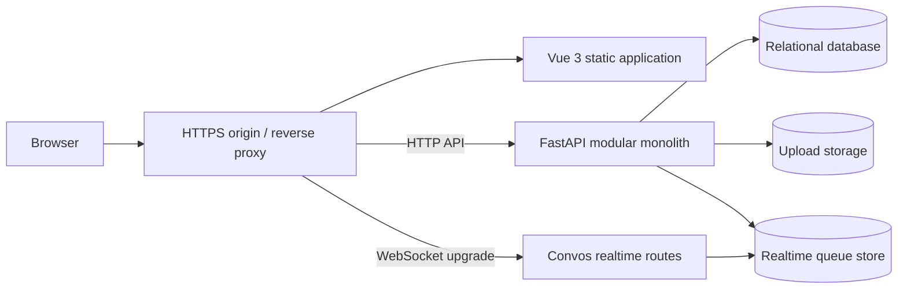
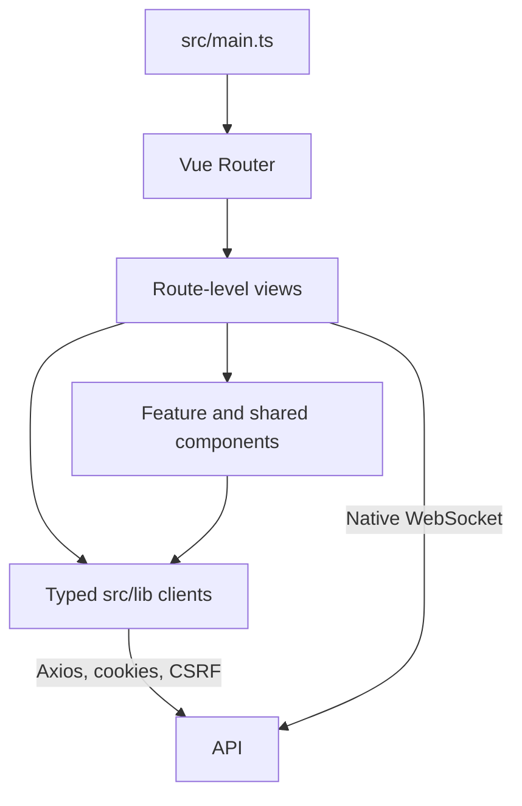
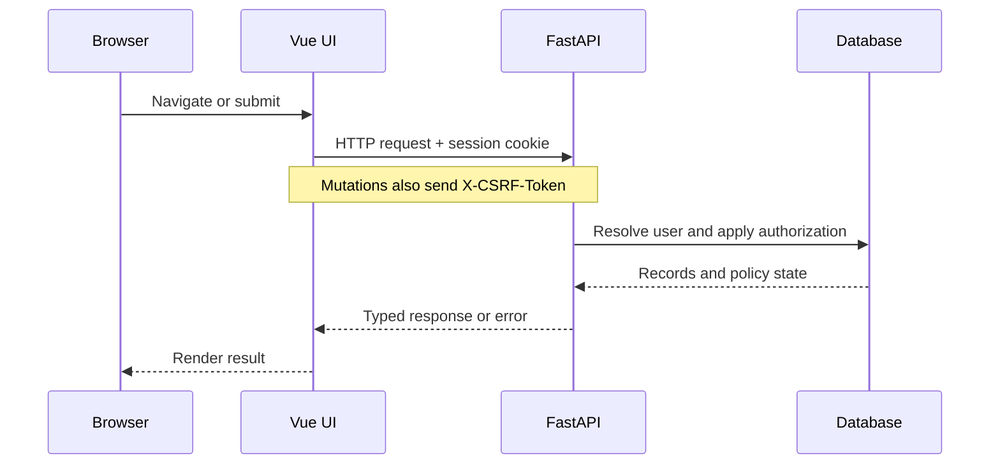

# Tanikala platform architecture

## Scope and status

Tanikala is a connected ecosystem with one shared identity and multiple applications:
Convos, Pondo, Sulat, and Aral. The current system consists of a Vue single-page
application and a FastAPI modular monolith. This document describes implemented
boundaries and separately labels production work that is not complete.



The preferred browser topology uses one HTTPS origin. Static UI routes resolve to
the Vue application, while `/auth`, `/users`, `/uploads`, `/fundraisers`, `/board`,
`/reviewer`, and `/chat` are proxied to the API. This keeps cookie authentication,
CSRF protection, uploads, and WebSockets consistent between development and
production.

## UI architecture

The UI is a Vue 3, TypeScript, and Vite application.



- `src/router/index.ts` defines public and authenticated navigation.
- `src/App.vue` and layout components provide the shared application shell.
- `src/views/` owns route-level screens.
- `src/components/` groups reusable workflows by product and shared concern.
- `src/lib/` owns HTTP/WebSocket adapters and TypeScript wire types.
- Views currently manage transient state locally; there is no global state store.

The route guard improves navigation but is not an authorization boundary. The API
must enforce authentication, ownership, moderation state, and data visibility.

## API architecture

The API is a FastAPI modular monolith. Shared platform concerns remain centralized,
while product behavior is organized into feature packages.

```text
app/
  core/                configuration, database, security, dependencies, uploads
  models/              shared identity, profile, and upload models
  schemas/             shared request and response schemas
  routes/              health, authentication, users, and uploads
  apps/
    chat/               Convos matching and realtime sessions
    fundraisers/        Pondo campaigns, updates, reports, and moderation
    board/              Sulat posts, reactions, reports, and review
    reviewer/           Aral sources, extraction, blueprints, and coverage
  main.py               application construction, middleware, and router mounting
alembic/                ordered relational schema migrations
tests/                  HTTP, WebSocket, persistence, and unit coverage
```

One service owns shared accounts, profiles, authentication, moderation primitives,
uploads, and database access. Product modules may be extracted only when independent
scaling or ownership is demonstrated; product breadth alone is not a reason to add
service boundaries.

## Authentication and request flow

Login establishes an HttpOnly JWT session cookie and a readable CSRF cookie.
State-changing HTTP requests echo the CSRF value through `X-CSRF-Token`. The API
resolves the user from the database for protected requests, so suspension and
ownership checks remain server-authoritative.



## Data and storage boundaries

- SQLModel and Alembic own relational persistence. SQLite is the local default;
  PostgreSQL is the durable deployment target.
- Public image uploads use a storage abstraction: local disk for development and
  S3-compatible private object storage with temporary access for deployment.
- Aral reviewer originals use a separate private path. The API extracts text locally
  and does not expose an endpoint that serves the original document.
- Aral blueprint versions retain official-source metadata and hashes. Generated
  study material must pin a blueprint version and preserve source provenance.
- Convos message bodies and live socket membership are currently ephemeral. Durable
  conversation metadata is relational, while realtime process state is not.

## Realtime boundary

Convos WebSocket connections, rooms, and timers are held in one API process. Redis
can persist ready-party queue state, but it does not distribute live sockets or room
membership. The API therefore runs with exactly one worker today. Multi-worker scale
requires a dedicated realtime gateway or a distributed broker-backed redesign.

## Product boundaries

| Product | UI responsibility | API responsibility |
| --- | --- | --- |
| Convos | Matching/chat experience and socket states | Waiting pools, rooms, limits, timers, and conversation metadata |
| Pondo | Campaign discovery and owner workflows | Campaigns, updates, uploads, reports, and moderation |
| Sulat | Planned public posting experience | Posts, reactions, reports, and approval workflow |
| Aral | Exam catalog, source upload, coverage, and future study modes | Private extraction, versioned blueprints, coverage mapping, and generation boundary |

## Change rules

- Wire-contract changes start in the API schema and canonical API documentation,
  then update the matching UI client, views, tests, and summaries.
- Database model changes require a reviewed Alembic migration.
- New browser-to-server paths must be added to both the development proxy and the
  production routing plan.
- New public data requires an explicit privacy and moderation review.
- New background or realtime workloads must document durability, retry, scaling,
  and shutdown behavior before release.

