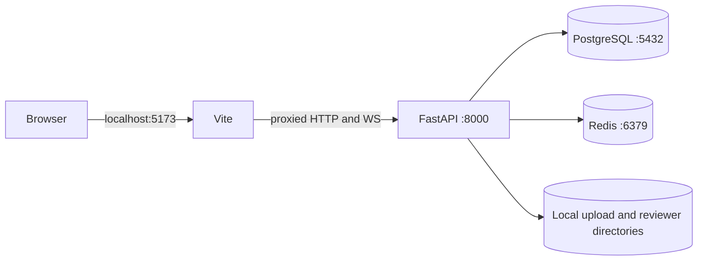
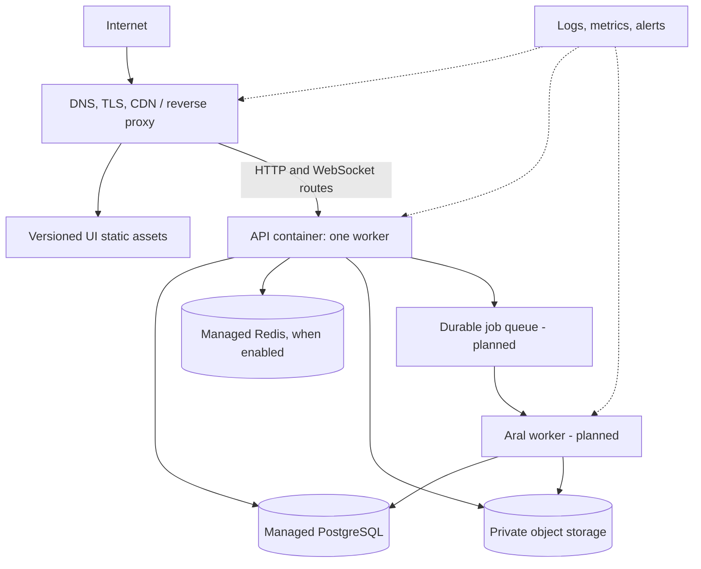

# Tanikala infrastructure

## Current state versus target

Tanikala has a reproducible local stack and CI verification, but a production cloud
provider and final managed services have not been selected. The target below records
required capabilities without claiming that they are already deployed.

| Area | Implemented today | Production target |
| --- | --- | --- |
| UI | Vite development server and static `dist/` build | Immutable static hosting behind one HTTPS origin |
| API | Uvicorn application and container image | Managed/container runtime with one API worker initially |
| Database | SQLite default; PostgreSQL in Compose | Managed PostgreSQL with backups and migration controls |
| Realtime queue | In-memory default; Redis option | Managed Redis when queue persistence is enabled |
| Public uploads | Local disk or S3-compatible adapter | Private object storage with temporary access URLs |
| Aral originals | Private gitignored local repository | Separate private object storage, retention, deletion, and malware scanning |
| Background work | Synchronous bounded Aral processing | Durable worker queue for extraction, OCR, generation, verification, and monitoring |
| Delivery | GitHub Actions lint/test/build checks | Tested image/static artifact publication and environment promotion |

## Local topology

The UI development server runs on port `5173` and proxies API paths to port `8000`.
The API can run directly with SQLite, or through Docker Compose with PostgreSQL and
Redis.



The Compose stack is for development and integration testing. Its published ports,
development credentials, and local volumes are not a production configuration.

## Production topology target



Required routing behavior:

- `/` and browser routes serve the Vue application with SPA fallback.
- API path groups proxy to FastAPI without caching authenticated responses.
- `/chat` supports WebSocket upgrades and long-lived connections.
- The proxy preserves request bodies, cookies, `Set-Cookie`, CSRF headers, and
  trusted forwarding headers.
- `/health` reaches the API for deployment probes.

## Runtime constraints

- The current API must run with `WEB_CONCURRENCY=1` because live Convos rooms and
  sockets are process-local.
- Production requires a non-default signing secret, HTTPS, and secure cookies.
- PostgreSQL migrations run during API startup. Rollouts must prevent incompatible
  application versions from racing a migration.
- Reviewer extraction is synchronously bounded to protect the API. OCR, large files,
  model work, and recurring PRC monitoring require a durable worker before release.
- Browser build variables are public. Credentials and model/provider secrets belong
  only in protected runtime configuration.

## Storage and data protection

- Separate relational backups from object-storage retention; both are necessary for
  recovery.
- Encrypt managed data in transit and at rest using provider controls.
- Public Pondo images and private Aral documents must not share access policy.
- Aral source text, originals, and generated provenance are private user content and
  must be excluded from public logs, analytics, and error payloads.
- Define retention and deletion behavior before moving reviewer files to production
  storage.
- Never place credentials, production exports, private reviewer material, payment
  details, or personal data in GitHub artifacts or issue attachments.

## Continuous integration and delivery

Current GitHub Actions checks:

- API: locked dependency install, Ruff lint, Ruff format check, complete Alembic
  upgrade, and pytest.
- UI: locked npm install, TypeScript/Vue checking, and production build.
- Dependabot: weekly dependency and GitHub Actions updates for both repositories.

The delivery target is:

```text
pull request
  -> required verification
  -> merge to main
  -> build immutable UI/API artifacts
  -> vulnerability and smoke checks
  -> publish to a registry/static host
  -> migrate and deploy to a non-production environment
  -> production approval and rollout
  -> post-deployment health and workflow checks
```

Container registry publication and production deployment automation are tracked work;
the current CI workflows verify source but do not claim to deploy it.

## Operations still required before public launch

- Select hosting, managed PostgreSQL, Redis, object storage, and registry providers.
- Add centralized structured logs, error monitoring, metrics, uptime probes, and
  actionable alerts without collecting private reviewer content.
- Establish database backups, restore testing, object retention, and disaster
  recovery objectives.
- Add container and dependency vulnerability scanning plus a patch response process.
- Add a durable Aral worker, retries, idempotency, malware scanning, and dead-letter
  handling.
- Document deployment ownership, secret rotation, incident response, rollback, and
  migration runbooks.

## Ownership

| Concern | Primary owner |
| --- | --- |
| Browser routes, static build, and client contracts | UI team |
| API runtime, migrations, persistence, and server contracts | API team |
| Shared routing, environments, secrets, observability, and recovery | Maintainers |
| Privacy, security, moderation, and launch policy | Maintainers with organization-owner approval |

