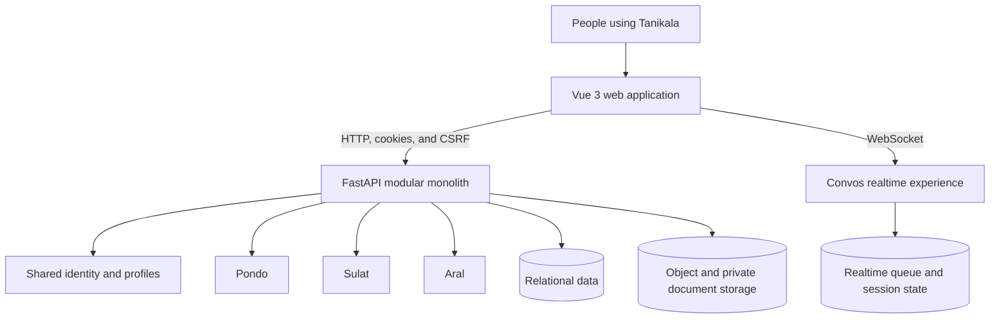

# Tanikala

**Technology for Filipinos, connected through one shared ecosystem.**

Tanikala builds focused applications that help people connect, learn, share,
and support one another. Each application has a distinct purpose while sharing
the same platform identity, safety standards, and engineering foundation.

## The ecosystem

| Application | Purpose | Product direction |
| --- | --- | --- |
| **Convos** | Connect | Meaningful conversations and new connections |
| **Pondo** | Support | Community fundraising with direct, transparent giving |
| **Sulat** | Share | A moderated space for stories and expression |
| **Aral** | Learn | Study tools for Philippine licensure exam preparation |

## How Tanikala fits together

The web application and API are separate builds presented through one HTTPS
origin. The API remains a modular monolith so shared accounts, authorization,
moderation, uploads, and persistence stay consistent across every product.

[Read the platform architecture](https://github.com/tanikala-ph/.github/blob/main/docs/architecture.md)

## Infrastructure snapshot

| Area | Current direction |
| --- | --- |
| Web | Vue 3, TypeScript, Vite, and immutable static assets |
| API | FastAPI container with a single worker while realtime state is process-local |
| Data | SQLite for lightweight local work; PostgreSQL for durable environments |
| Realtime | In-memory development path with Redis-backed queue support |
| Files | Local development storage with an S3-compatible production boundary |
| Delivery | GitHub Actions verification; registry publishing and deployment automation are tracked work |

The production provider has not been selected. Public documentation separates
implemented capabilities from the intended production topology and launch work.

[Read the infrastructure overview](https://github.com/tanikala-ph/.github/blob/main/docs/infrastructure.md)

## Engineering hub

- [Engineering documentation](https://github.com/tanikala-ph/.github/tree/main/docs)
- [Governance](https://github.com/tanikala-ph/.github/blob/main/GOVERNANCE.md)
- [Contributing](https://github.com/tanikala-ph/.github/blob/main/CONTRIBUTING.md)
- [Security policy](https://github.com/tanikala-ph/.github/blob/main/SECURITY.md)
- [Code of conduct](https://github.com/tanikala-ph/.github/blob/main/CODE_OF_CONDUCT.md)

Product source repositories remain private while the platform is under active
development. Roadmap work is organized through GitHub issues and the Tanikala
Roadmap before implementation begins.

## Contact

For support, privacy, security, or partnership inquiries, email
`support@tanikala.ph`. Do not place credentials, personal information, payment
details, or private reviewer content in a public GitHub issue.
